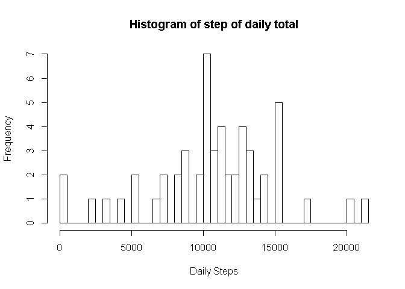
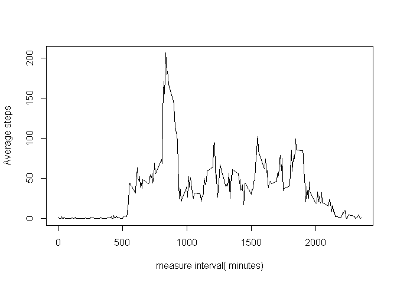
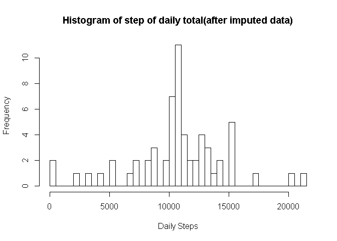

# Reproducible Research: Peer Assessment 1


## Loading and preprocessing the data

* Load nessary library

```r
library(dplyr)
```

```
## 
## Attaching package: 'dplyr'
```

```
## The following objects are masked from 'package:stats':
## 
##     filter, lag
```

```
## The following objects are masked from 'package:base':
## 
##     intersect, setdiff, setequal, union
```

```r
library(lubridate)
```

```
## 
## Attaching package: 'lubridate'
```

```
## The following object is masked from 'package:base':
## 
##     date
```

```r
library(lattice)
```
* Extract data from zip file if not done yet  

```r
if (!file.exists('activity.csv')) unzip('activity.zip')
```
* Load .csv to memory  

```r
dat <- read.csv('activity.csv')
```

## What is mean total number of steps taken per day?

* remove NA from the data and comupte steps per day

```r
dat.clean <- dat[complete.cases(dat),]
daily.sum<-summarise(group_by(dat.clean, date), steps=sum(steps))
```

* Daily steps

```r
hist(daily.sum$steps, breaks=nrow(daily.sum),main = 'Histogram of step of daily total', xlab = 'Daily Steps')
```

<!-- -->

* Daily mean and median of the total number of steps taken per day 


```r
daily.mean = mean(daily.sum$steps)
daily.mean
```

```
## [1] 10766.19
```

```r
daily.median = median(daily.sum$steps)
daily.median
```

```
## [1] 10765
```
## What is the average daily activity pattern?


```r
interval.mean <- summarise(group_by(dat.clean, interval), steps.mean=mean(steps))

plot(interval.mean$interval, interval.mean$steps.mean, type='l', xlab='measure interval( minutes)', ylab = 'Average steps')
```

<!-- -->

## Imputing missing values
* calculate total missing values in the data set

```r
dat.NA<-dat[!complete.cases(dat),]
nrow(dat.NA)
```

```
## [1] 2304
```

```r
table(factor(dat.NA$date))
```

```
## 
## 2012-10-01 2012-10-08 2012-11-01 2012-11-04 2012-11-09 2012-11-10 
##        288        288        288        288        288        288 
## 2012-11-14 2012-11-30 
##        288        288
```
* Fill missing data with mean value.

```r
# take step mean for impute
dat.NA.impute<-left_join(x=dat.NA, y = interval.mean)
```

```
## Joining, by = "interval"
```

```r
# impute value when it is NA
dat.NA.impute$steps <- ifelse(is.na(dat.NA.impute$steps), dat.NA.impute$steps.mean, dat.NA.impute$steps)
# re-format the column.
dat.NA.impute$steps.mean <-NULL
# combine clean data with imputed data
dat.impute <-rbind(dat.clean, dat.NA.impute)
daily.sum.impute<-summarise(group_by(dat.impute, date), steps=sum(steps))
```
* Histogram after missing values are imputed

```r
hist(daily.sum.impute$steps,main = 'Histogram of step of daily total(after imputed data)', xlab = 'Daily Steps', breaks=nrow(daily.sum.impute))
```

<!-- -->

```r
# mean & median calculation
daily.mean.impute <- mean(daily.sum.impute$steps)
daily.mean.impute
```

```
## [1] 10766.19
```

```r
daily.median.impute = median(daily.sum.impute$steps)
daily.median.impute
```

```
## [1] 10766.19
```
* **Conlcusion** The mean step over day doesn't change between prior and after impute data. Since the method of impute data is using mean value of all days by interval
The median shift a little bit since it changed the whole data distribution by impute mean values to missing values.
## Are there differences in activity patterns between weekdays and weekends?


```r
dat.impute$wday <- as.factor(ifelse(strftime(ymd(dat.impute$date), '%a') %in% c('Mon', 'Tue','Wed', 'Thu', 'Fri'), 'weekday', 'weekend'))
interval.mean.impute <- summarise(group_by(dat.impute, interval , wday), steps.mean=mean(steps))

#plot(interval.mean$interval, interval.mean$steps.mean, type='n', xlab='measure interval( minutes)', ylab = 'Average steps', axes=FALSE)
#lines(interval.mean.impute[interval.mean.impute$wday == 'weekday',]$interval, interval.mean.impute[interval.mean.impute$wday == 'weekday',]$steps.mean, type='l', col=3)
#lines(interval.mean.impute[interval.mean.impute$wday == 'weekend',]$interval, interval.mean.impute[interval.mean.impute$wday == 'weekend',]$steps.mean, type='l', col=2)
#axis(side=1, at=seq(0,2400, by=100))
#axis(side=2, at=seq(0, max(interval.mean.impute$steps.mean), by=50))
#legend('topright', lty=1,col=c(3,2), legend=c('weekday', 'weekend'))
#box()


xyplot(interval.mean.impute$steps.mean~interval.mean.impute$interval| interval.mean.impute$wday  , type='l',layout=c(1,2) , xlab='Interval', ylab='Number of steps')
```

<!-- -->
