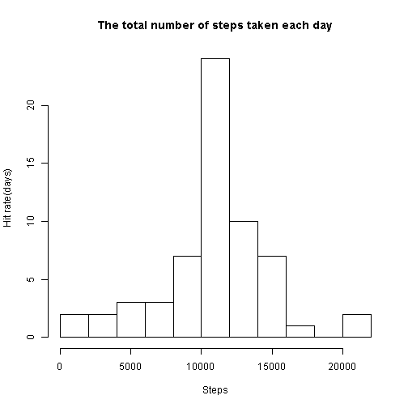
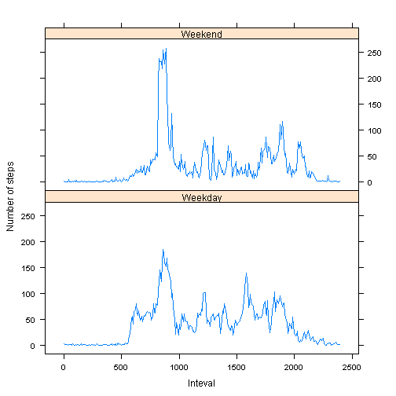

---
title: "RepData_PeerAssessment1"
author: "Steve"
date: "August 13, 2015"
output: html_document
---

This is an R Markdown document for assigment RepData_PeerAssessment1
URL of this file is : <https://github.com/forest416/RepData_PeerAssessment1/blob/master/PA1_template.Rmd>

##Loading and preprocessing the data

* The source data file is download from xx and unzip to local directory with .R and .Rmd file together.
* File is read by function call read.csv to variable **acti.raw**. All columns are *character* class.
* Cast class if neccesary.
* Split dataset into two:
    1. acti -- data without 'NA' in obvervation
    2. acti.NA -- dataset that has 'NA' in obveration column *step*


```r
acti.raw = read.csv('activity.csv', colClasses = c('character', 'character', 'character'), 
                   header = T, sep=',')

acti.raw$steps = as.numeric(acti.raw$steps)
acti.raw$date = as.factor(acti.raw$date)
acti.raw$dt = strptime(acti.raw$date, '%Y-%m-%d') + (as.numeric(acti.raw$interval) *5 *60)
acti.raw$interval = (as.numeric(acti.raw$interval) %/% 100) + as.numeric(acti.raw$interval) %% 100 /60

acti= acti.raw[!is.na(acti.raw$step) ,]
acti.NA= acti.raw[is.na(acti.raw$step) ,]

acti=acti[!is.na(acti$steps),]
all.step=acti$steps
```


##What is mean total number of steps taken per day?

* datset **daily.step** is derived from **acti**, contains total step of each day
* Draw histogram of total number of steps taken each day.
* daily mean is calculated
* daily median is calculated


```r
daily.step = aggregate(acti$steps, by=list(acti$date),FUN=sum)
names(daily.step) = c('date', 'steps')

hist(daily.step$steps, breaks=10, main='The total number of steps taken each day', 
     xlab = 'Steps', ylab='Hit rate(days)' )
```

 

```r
daily.mean=mean(daily.step$steps)
daily.mean
```

```
## [1] 10766.19
```

```r
daily.median=median(daily.step$steps)
daily.median
```

```
## [1] 10765
```

##What is the average daily activity pattern?

* Dataset **acti.daily** is prepared from **acti** by summing step by each observation interval from each day.
* Plot is drawn with dataset **acti.daily**
    x-axis is hours, each vertical line presents one observation interval ( 5 miutes interval)
    y-axis is mean steps taken over all observation days
  


```r
daily.step.mean = mean(aggregate(acti$steps, by=list(acti$date), FUN=sum)$x)
print(daily.step.mean)
```

```
## [1] 10766.19
```

```r
acti.daily = aggregate(acti$steps, by=list(acti$interval), FUN = mean)
names(acti.daily) = c('interval','steps')
plot(acti.daily$interval, acti.daily$step,  type='h', xaxt='n',
     main='Average daily activity pattern', 
     xlab = 'Time (Clock hour)', ylab='Steps by 5-minutes inteval')
lines(acti.daily$interval, acti.daily$step, type='l' ,col='blue',lwd = 1)
axis(1, at=seq(0, 24, by=1),las=2)
```

 
  
* The daily pattern is in such shape:
    1. Before 5:30 AM, almost no activity.
    1. Step count ramp up betwen 6AM and 8AM
    1. The peak activity is between 8AM and 9AM 
    2. lunch time start at 12 O'clock
    3. After 4PM, more step. It might include commute to home, shopping, prepare dinner or activity after dinner.
    3. After 10 PM, less activity.
    
    
    
##Imputing missing values

###1. Calculate and report the total number of missing values in the dataset (i.e. the total number of rows with NAs)

####How much data is missing with 'NA' in step field?

As we know the obervation is by 5 minutes interval, the daily observations are 24 (hours) * 60 (minutes) / 5 (minutes) = 288
By the measure measurement above, only 8 whole days observation is missing.


```r
xtabs(data=acti.NA, formula =  ~ date )
```

```
## date
## 2012-10-01 2012-10-02 2012-10-03 2012-10-04 2012-10-05 2012-10-06 
##        288          0          0          0          0          0 
## 2012-10-07 2012-10-08 2012-10-09 2012-10-10 2012-10-11 2012-10-12 
##          0        288          0          0          0          0 
## 2012-10-13 2012-10-14 2012-10-15 2012-10-16 2012-10-17 2012-10-18 
##          0          0          0          0          0          0 
## 2012-10-19 2012-10-20 2012-10-21 2012-10-22 2012-10-23 2012-10-24 
##          0          0          0          0          0          0 
## 2012-10-25 2012-10-26 2012-10-27 2012-10-28 2012-10-29 2012-10-30 
##          0          0          0          0          0          0 
## 2012-10-31 2012-11-01 2012-11-02 2012-11-03 2012-11-04 2012-11-05 
##          0        288          0          0        288          0 
## 2012-11-06 2012-11-07 2012-11-08 2012-11-09 2012-11-10 2012-11-11 
##          0          0          0        288        288          0 
## 2012-11-12 2012-11-13 2012-11-14 2012-11-15 2012-11-16 2012-11-17 
##          0          0        288          0          0          0 
## 2012-11-18 2012-11-19 2012-11-20 2012-11-21 2012-11-22 2012-11-23 
##          0          0          0          0          0          0 
## 2012-11-24 2012-11-25 2012-11-26 2012-11-27 2012-11-28 2012-11-29 
##          0          0          0          0          0          0 
## 2012-11-30 
##        288
```


#### Is there any partial data missing in any day?
In another spect, when look into non-NA obervations, non-zero obesavertion days have 288 obeservation. Which means no single missing observation in those days.


```r
xtabs(data=acti, formula =  ~ date )
```

```
## date
## 2012-10-01 2012-10-02 2012-10-03 2012-10-04 2012-10-05 2012-10-06 
##          0        288        288        288        288        288 
## 2012-10-07 2012-10-08 2012-10-09 2012-10-10 2012-10-11 2012-10-12 
##        288          0        288        288        288        288 
## 2012-10-13 2012-10-14 2012-10-15 2012-10-16 2012-10-17 2012-10-18 
##        288        288        288        288        288        288 
## 2012-10-19 2012-10-20 2012-10-21 2012-10-22 2012-10-23 2012-10-24 
##        288        288        288        288        288        288 
## 2012-10-25 2012-10-26 2012-10-27 2012-10-28 2012-10-29 2012-10-30 
##        288        288        288        288        288        288 
## 2012-10-31 2012-11-01 2012-11-02 2012-11-03 2012-11-04 2012-11-05 
##        288          0        288        288          0        288 
## 2012-11-06 2012-11-07 2012-11-08 2012-11-09 2012-11-10 2012-11-11 
##        288        288        288          0          0        288 
## 2012-11-12 2012-11-13 2012-11-14 2012-11-15 2012-11-16 2012-11-17 
##        288        288          0        288        288        288 
## 2012-11-18 2012-11-19 2012-11-20 2012-11-21 2012-11-22 2012-11-23 
##        288        288        288        288        288        288 
## 2012-11-24 2012-11-25 2012-11-26 2012-11-27 2012-11-28 2012-11-29 
##        288        288        288        288        288        288 
## 2012-11-30 
##          0
```


##2. Devise a strategy for filling in all of the missing values in the dataset. The strategy does not need to be sophisticated. For example, you could use the mean/median for that day, or the mean for that 5-minute interval, etc.

To impute missing values may not be good idea, depend on what the purpose is. The imputed data is not the nature data. The impute value are based on operate's thought. With the imputed data, the whole dataset attribute may altered/deviated from the original collected data. Let's pick two of the attributes: mean and median. When I impute the data as others days' mean, the result data's mean stays the same. The result dataset's median changes. it is due to the collected data can't be the perfect shape that mean equal to median.

If we impute the missing data with median of collected data by the 5minutes interval of the day. The median of the result stay the same but the mean shifts to different value.

In another word, fake value should be introduced. It change the the attribute of the dataset, at least the sample size. With changes on sample size, any attribute based on sample size will be affected. 

The following steps are the method impute missing data with the mean of step of the day.


```r
acti.NA.impu = merge(acti.NA, acti.daily, by.x='interval', by.y='interval')

acti.NA.impu$steps=acti.NA.impu$steps.y
acti.NA.impu$steps.x = NULL
acti.NA.impu$steps.y = NULL

acti.impu = rbind(acti, acti.NA.impu)
```


Since the algrhim of filling data is to use 5-minute mean of the actual data. The shap of plot "Steps by 5-minutes inteval vs Time (Clock hour)" doesn't have change.


```r
acti.daily.impu = aggregate(acti.impu$steps, by=list(acti.impu$interval), FUN = mean)
names(acti.daily.impu) = c('interval','steps')
plot(acti.daily.impu$interval, acti.daily.impu$step,  type='h', xaxt='n',
     main='Average daily activity pattern', 
     xlab = 'Time (Clock hour)', ylab='Steps by 5-minutes inteval')
lines(acti.daily.impu$interval, acti.daily.impu$step, type='l' ,col='blue',lwd = 1)
axis(1, at=seq(0, 24, by=1),las=2)
```

 

As said, the atrribute that is not calculated the same as the impute algrithm will be affected.
histogram of steps


```r
daily.step.impu = aggregate(acti.impu$steps, by=list(acti.impu$date),FUN=sum)
names(daily.step.impu) = c('date', 'steps')

hist(daily.step.impu$steps, breaks=10, main='The total number of steps taken each day', 
     xlab = 'Steps', ylab='Hit rate(days)' )
```

 

Compare to the earlier histogram, the day count of steps between 10,000 and 11,000 increasd from 16 to 24


```r
daily.mean.impu=mean(daily.step.impu$steps)
daily.mean.impu
```

```
## [1] 10766.19
```

```r
daily.median.impu=median(daily.step.impu$steps)
daily.median.impu
```

```
## [1] 10766.19
```

And, we can see the mean of the daily step stay the same as prior data imputing. The median shift.


##Are there differences in activity patterns between weekdays and weekends?


```r
library(lattice)

acti.impu.wk = acti.impu
acti.impu.wk$wk = factor(weekdays(acti.impu.wk$dt))
acti.impu.wk$wd=factor(c('Weekday', 'Weekend'))
acti.impu.wk[acti.impu.wk$wk %in% as.factor(c('Monday', 'Tuesday',  "Wednesday", "Thursday", "Friday")), ]$wd = as.factor('Weekday')

acti.impu.wk[!acti.impu.wk$wk %in% as.factor(c('Monday', 'Tuesday',  "Wednesday", "Thursday", "Friday")), ]$wd = as.factor('Weekend')

acti.impu.wk.agg=aggregate(acti.impu.wk$steps, by=list(acti.impu.wk$interval, acti.impu.wk$wd),FUN=mean)

names(acti.impu.wk.agg) =c('interval','wd','steps')


xyplot(data = acti.impu.wk.agg, steps~ interval*100|wd , layout=c(1,2), type='l', 
       xlab = 'Inteval', 
       ylab = list('Number of steps'))
```

 


* Weekday and weekend pattern have difference:
    1. Both, wake up after 5:30am, weekday have higher steps
    2. Both peak at 9AM, weekend has hight steps.  
    3. Weekdays have second peak at 1600 ~ 1700. To weekend, it is at 1900.
    

